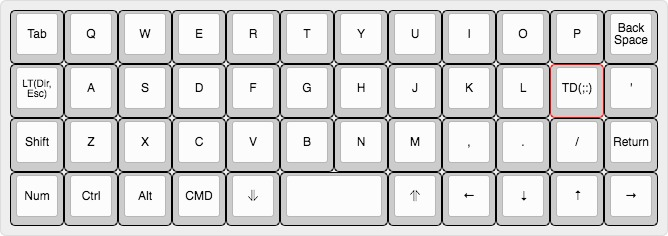
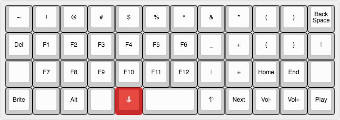
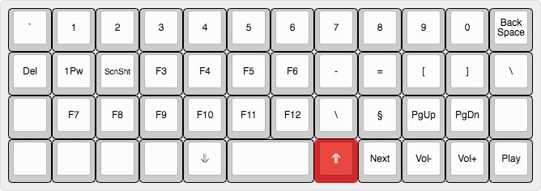
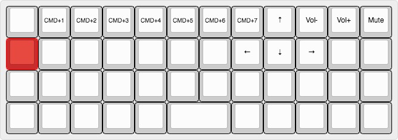
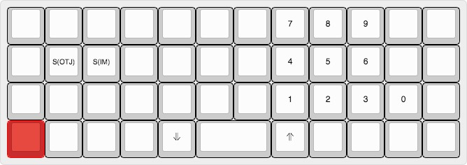

# Customized Planck Layout

This layout is based off the default layout with a few changes. I work as a web developer, so these changes are primarly aimed for me.

## Layers

#### Base (QWERTY)

#### LOWER

#### RAISE

#### DIRLAYER

#### NUMLAYER
